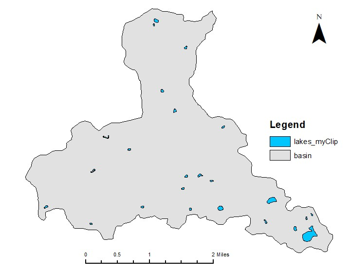

# LAB 1: GEOPROCESSING IN ARCGIS

This repo contains two scripts, file_flooding.py and lakes_myClip.py, and an image of the output of lakes_myClip.py.  Both scripts use geoprocessing tools in the ArcGIS environment to create and save outputs to a local drive. 

## Input shapefiles

The files used in these scripts are shapefiles of a basin, floodzone, and lakes in Northern Minnesota, just east of Fargo, North Dakota. 

##  Floodzone Clip and Selection (file.flooding.py)

This script was created by exporting a .py script from ArcGIS Model Builder.  The result clips the floodzone shapefile to the basin shapefile.  Then, the attribute "IN" in the field "within Special Flood Areas" is selected.  The following is how the code runs:

1. The arcpy module is imported.
2. Local variables are assigned where the flooding and basin shapefiles are the inputs and two destinations in the Results folder on the local drive are assigned for where the outputs will be saved.
3. The clip tool is then called, where the floodzone shapefile is clipped to the basin shapefile.  The output flood_Clip.shp, is assigned to one variable destination.
4. The select by attribute tool is called where all features in the clipped floodzone that have the attribute "IN" for the "within Special Flood Area" are selected.  The output flooding.shp is assigned to the second destination variable.

##  Lakes Clip (my_clip.py)

This script clips the lakes shapefile input to the basin shapefile.  The following is how this code runs:

1. The arcpy module is imported
2. The geoprocessing workspace is assigned to the lab folder on the local drive.
3. The clip tool is called where the lakes shapefile within the Data_Lab_1_Geoprocessing_ArcGIS folder is the input feature, the basin shapefile within the Data_Lab_1_Geoprocessing_ArcGIS folder is the clip feature.
4. The tool saves the shapefile result, all lakes within the basin, to the Results folder on the local drive.

## my_clip.py Output Image

The following is the output of the second script.  The output are the Lakes in blue, and the clip feature basin shapefile is in grey.

